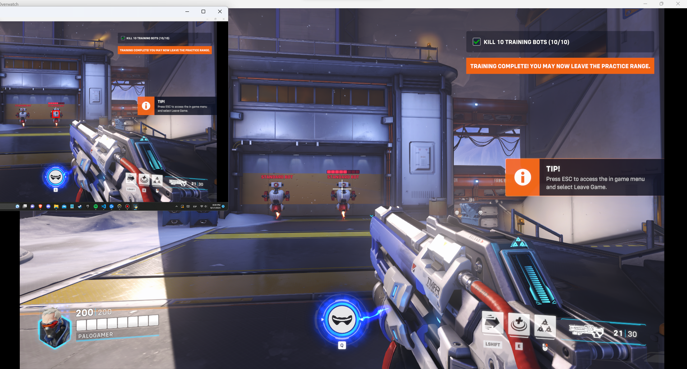

# Overwatch2_AI_Triggerbot
This is an automatic triggerbot that uses a CNN model to detect robots in the screen ( only in the training camp ) and then triggers the shoot button when you are aiming at one. Also, Use soldier 76, as it was used for training.
<html>
  
  
  
  
</html>
